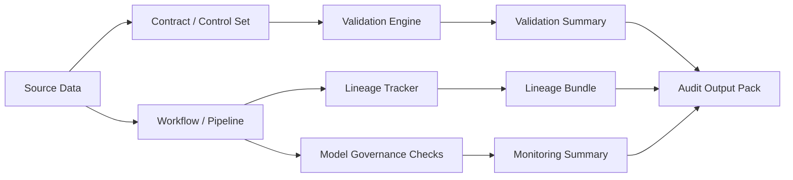

# Architecture

FDGF is structured as a small control framework rather than a single application. It separates reusable governance primitives from workflow-specific examples. The core pattern is: define controls in configuration, execute them in code, emit reviewable artifacts, and preserve lineage for every run.

## Core Layers

1. Control definition
   YAML rule contracts and control sets define validation logic outside application code.
2. Control execution
   The validator executes rule sets against dataframes and emits machine-readable audit bundles.
3. Lineage and run evidence
   The lineage tracker records inputs, outputs, transformations, and run metadata.
4. Model-governance checks
   Drift and fairness utilities provide lightweight monitoring evidence for model-driven workflows.

Reference workflows show where these four layers fit into scheduled data processing, but workflow orchestration is not treated as a separate framework layer in this repository.

## Core Components

- [`governance/data_quality/validators.py`](../governance/data_quality/validators.py)
  Executes contract-driven validation rules and emits machine-readable audit bundles.
- [`governance/lineage/tracker.py`](../governance/lineage/tracker.py)
  Records inputs, outputs, transformations, and run events as lineage artifacts.
- [`governance/model_governance/drift_detector.py`](../governance/model_governance/drift_detector.py)
  Produces drift and fairness findings for model-governance workflows.
- [`governance/reporting/compliance_summary.py`](../governance/reporting/compliance_summary.py)
  Converts raw artifacts into reviewer-friendly summaries.
- [`governance/pipelines/basel3_pipeline.py`](../governance/pipelines/basel3_pipeline.py)
  Shows how governance checks are embedded in a reference reporting workflow.

## Reuse Pattern

The framework is designed to be reused by swapping the data contract, operating profile, and workflow profile while keeping the validation, lineage, and summary components unchanged.

Typical reuse steps:

1. Choose a contract under `templates/data_contracts/`.
2. Choose an institution profile under `templates/institution_profiles/` or `assets/operating_profiles/`.
3. Execute validation and lineage capture in the workflow.
4. Publish the generated artifacts for review and audit.

## Current Boundary

The repository provides governance primitives, configuration templates, local evaluation paths, and runnable examples. Deployment automation, external system adapters, and production infrastructure are institution-specific concerns outside the scope of a vendor-neutral reference implementation.
